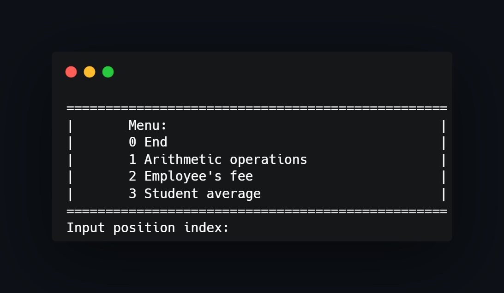

## What project do?
___

Project shows basics of creating classes with its own methods. Classes declarations and definitions are in different files to keep everything organized.

## How to use?
___
Just import project to CodeBlocks and compile/run. If you wish you could use another environment by using only main.cpp file.

<!--https://banner.godori.dev/-->
<!--https://shields.io/-->
<!--https://carbon.now.sh/-->